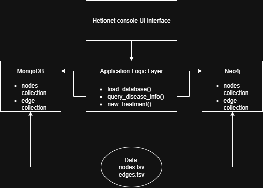

# Setup

## Installation

### Installing Required Packages
```
pip install pandas pymongo neo4j
```
### Install MongoDB, MongoDB Compass, and Neo4j

#### Setup a Directory for Data (if not done so)
```
mkdir Data
```
#### Starting up MongoDB
```
net start MongoDB
```
### Create Neo4j Instance & Database

Neo4j requires you to manually create a database. You can do this via the Neo4j Desktop application or by connecting to the web console at http://localhost:7474.

---

# Running the Project
```
python hetio_cli.py
```
---

# Queries

### Query 1

    MATCH (d:Disease {id: $disease_id})
    OPTIONAL MATCH (c1:Compound)-[:CtD]->(d)
    OPTIONAL MATCH (c2:Compound)-[:CpD]->(d)
    OPTIONAL MATCH (d)-[:DaG]->(g:Gene)
    OPTIONAL MATCH (d)-[:DlA]->(a:Anatomy)
    RETURN 
        d.name AS disease_name,
        collect(DISTINCT c1.name) + collect(DISTINCT c2.name) AS drugs,
        collect(DISTINCT g.name) AS genes,
        collect(DISTINCT a.name) AS anatomies

**Explanation:**

- Match a node with the given disease_id.  
- Optionally match compounds that treat (CtD) or palliate (CpD) the disease.  
- Optionally match genes associated with the disease (DaG).  
- Optionally match anatomies where the disease localizes (DlA).  
- Return the disease name, list of treatment and palliation compounds (combined as drugs), associated genes, and affected anatomies.

---

### Query 2

    MATCH (d:Disease {id: $disease_id})-[:DlA]->(a:Anatomy)
    MATCH (a)-[ag:AuG|AdG]->(g:Gene)
    MATCH (c:Compound)-[cg:CuG|CdG]->(g)
    WHERE (
        (type(ag) = "AuG" AND type(cg) = "CdG") OR
        (type(ag) = "AdG" AND type(cg) = "CuG")
    )
    AND NOT (c)-[:CtD|CpD]->(d)
    RETURN DISTINCT c.id AS compound_id, c.name AS compound_name

**Explanation:**

- Match the disease node with the given disease_id.  
- Match anatomies that the disease localizes to (DlA).  
- Match genes either upregulated (AuG) or downregulated (AdG) in those anatomies.  
- Match compounds that upregulate (CuG) or downregulate (CdG) those genes.  
- Filter for compounds whose gene regulation type is the opposite of the anatomy's gene regulation.  
- Ensure compounds are **not already** known to treat or palliate the disease.  
- Return distinct compound IDs and names as potential new treatments.

---

# Design Diagram


